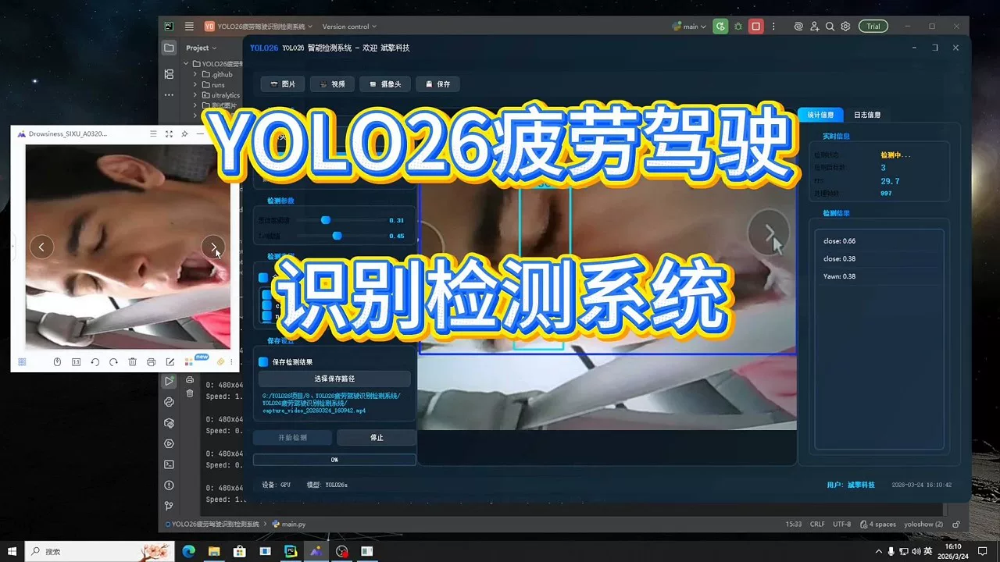
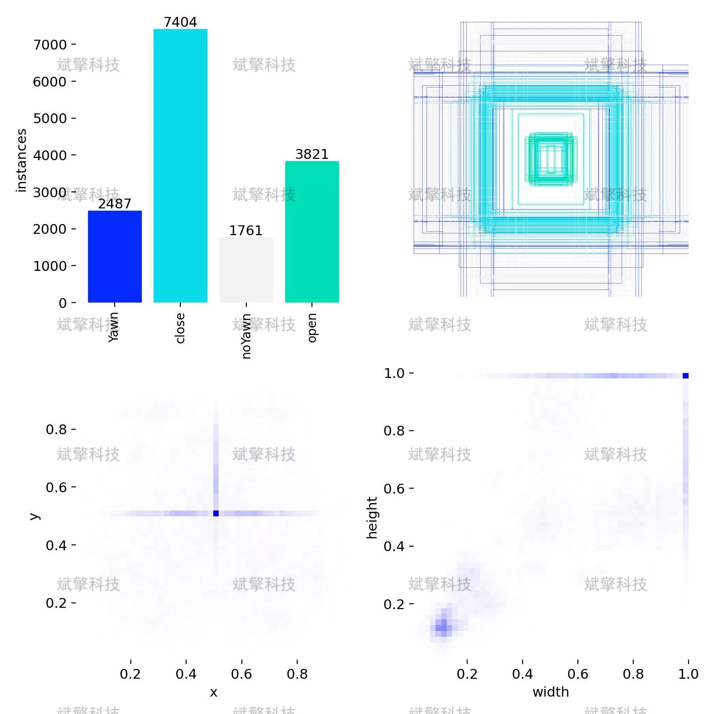
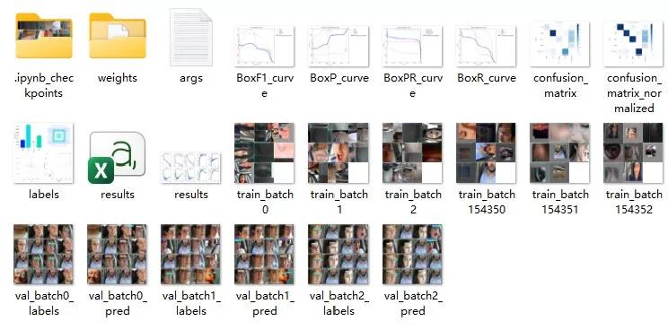
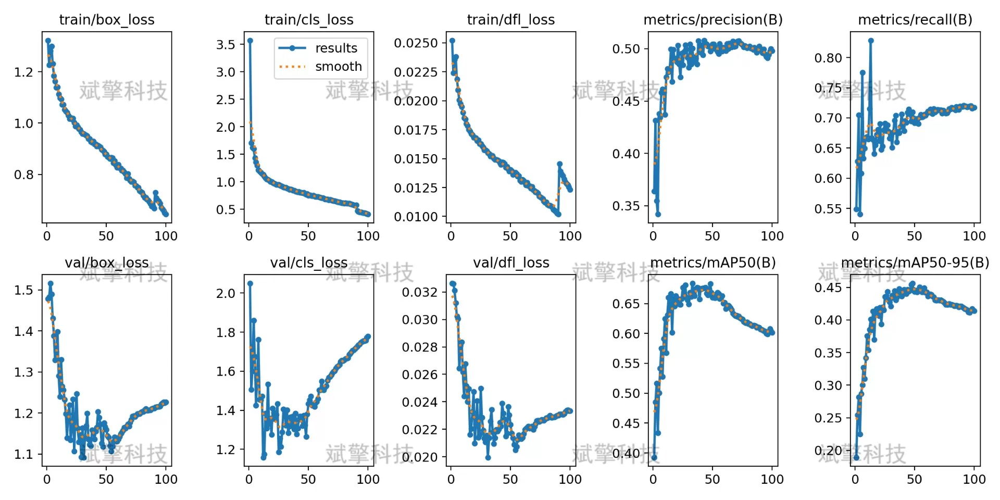
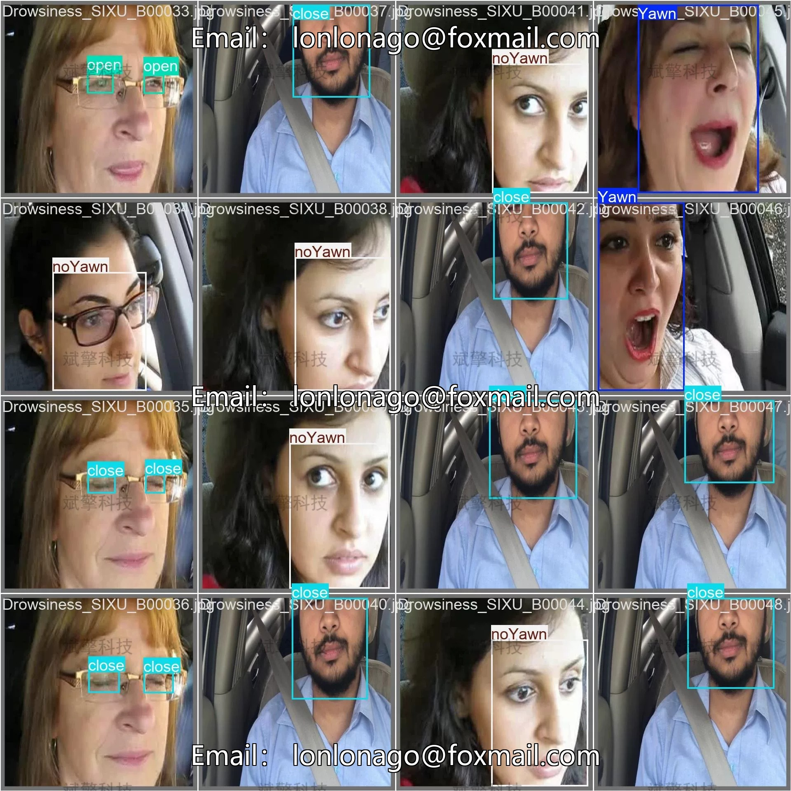
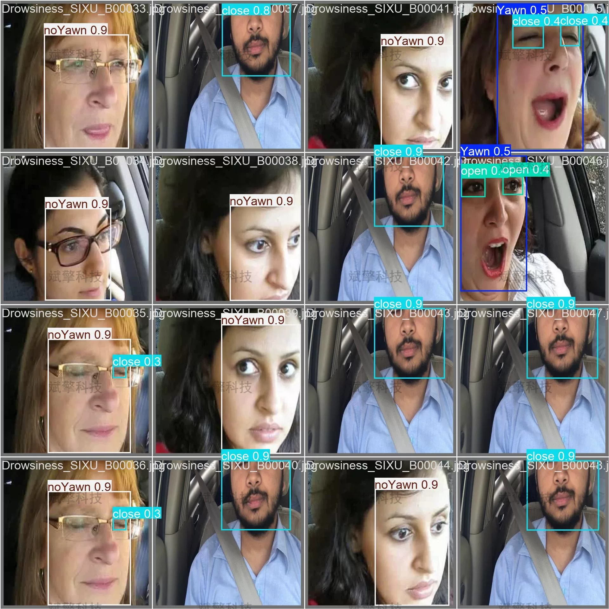
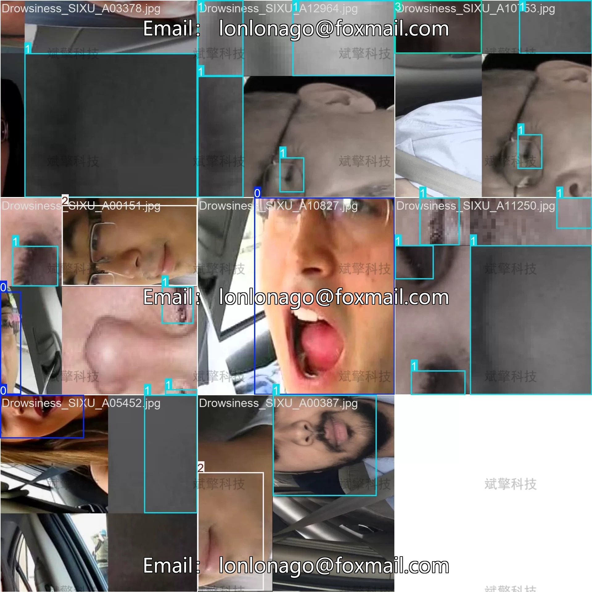
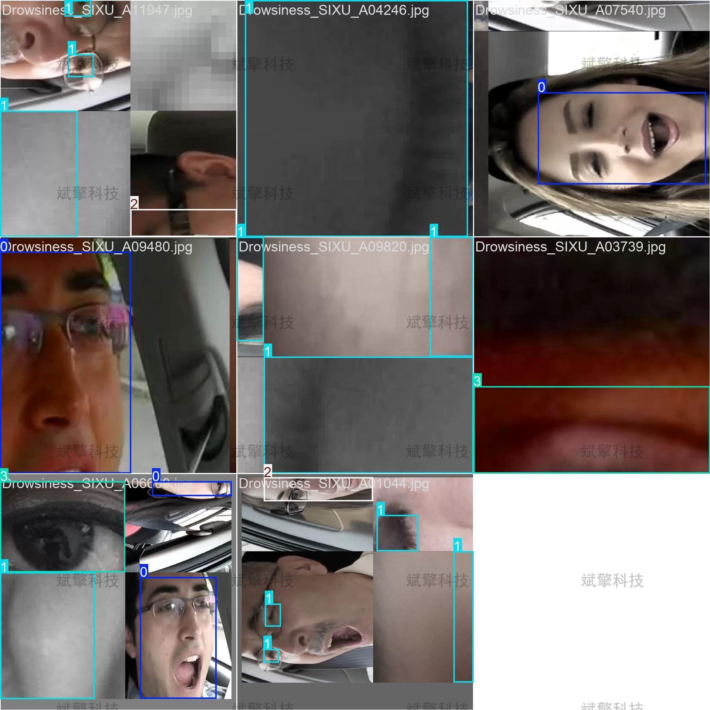

# YOLOv26 Fatigue Driving Detection System | Source Code + Model

## Body

YOLO26 Fatigue Driving Detection System | Source Code + Model YOLO26 Application in Fatigue Driving Recognition: Multi-Category Facial State Detection (Project Source Code + Dataset + Model Weights + UI Interface + Python + Deep Learning + Remote Environment Deployment)

Fatigue driving is one of the main causes of traffic accidents, and a driver status monitoring system based on vision has significant importance for preventing fatigue driving. This study builds a fatigue recognition detection system for driver facial states based on the YOLO26 object detection algorithm. The system includes four detection categories: yawning (Yawn), closing eyes (close), normal open eyes (open), and not yawning (noYawn). The dataset consists of 13719 images for training, 1380 for validation, and 1147 for testing.

Dataset Scale and Division
The dataset used in this study contains image samples of driver facial states, totaling 16246 images. The dataset is divided as follows:
Training set: 13719 images, accounting for 84.4%, used for model training and parameter updates
Validation set: 1380 images, accounting for 8.5%, used for model tuning and hyperparameter selection
Test set: 1147 images, accounting for 7.1%, used for final performance evaluation

Classification and Explanation
The dataset contains 4 detection categories, specifically defined as follows:
Yawn (Yawn)
Close (Close)
NoYawn (Not Yawn)
Open (Open)

Free reservation for remote installation. Unsuccessful full refund.
Purchase Enjoy the following resources (Baidu Driven Auto-unlock)
     YOLO Recognition Detection Project Complete Source Code
    ️ YOLO format Dataset
      Training code + UI interface code
      Trained model + results image
      Software installer
    ️ Add WeChat to make a reservation for remote installation (Purchase will automatically display WeChat ID) - Unsuccessful full refund

⚙️ Core Functional Modules
Detection Capability
    Image Detection: Upon upload, return detection boxes + category information
    Video Detection: Supports video files, analyzes frames accurately
    Camera Real-time Detection: Connects USB camera, realizes dynamic monitoring
Interaction and Control
    Target Filtering: Choose one or more categories for detection
    Parameter Real-time Adjustment: Adjustable confidence threshold & IoU threshold, flexible control accuracy
    Result Save: One-click save of images/videos/camera detection results
System and Data
    User login registration: Support password strength detection + encryption storage
    Log recording: Records operation and error information (with timestamp)

## Images

## Payment

Here is a pay link on Stripe ( https://buy.stripe.com/3cs8yP7sY87d0vu9AB ). Please contact me lonlonago@foxmail.com after funding $89, and I will send you a complete data files , thank you!

